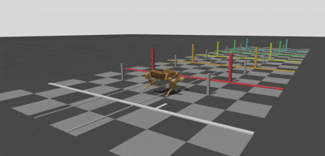
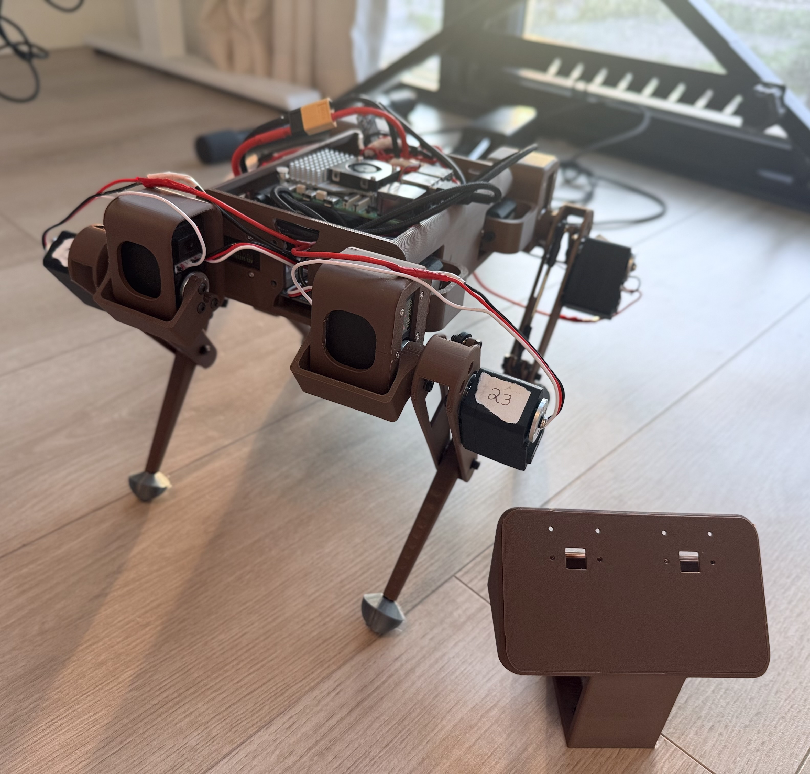
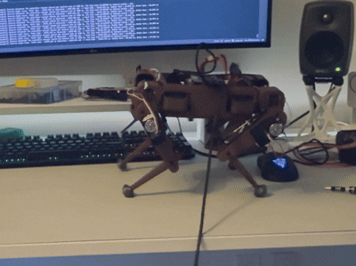

<p>
  
</p>
<small>
  Custom desktop-size quadruped robot — from design and CAD to ROS 2 simulation and a physical build.
</small>

<hr/>

## About

**Quad-Quad Bot** is a quadruped (four-legged) robot built by me as a solo side-project. It spans the full mechatronics stack:

- **Mechanical** — from-scratch design, CAD in SolidWorks, and 3D-printed parts.
- **Electronics** — custom power distribution, motor drivers, onboard compute
- **Software** — ROS 2 (Jazzy), Gazebo Harmonic simulation, inverse kinematics, gait planning, and feedback loops.

<i> Current status: simulation is running with a trot gait. Hardware assembled. Currently tuning walking gaits(crawl, trot, and maybe gallop). </i>

<hr/>

## Gallery

<table>
  <tr>
    <td align="center" width="50%">
      
      <br/><br/><b>CAD Model</b>
    </td>
    <td align="center" width="50%">
      
      <br/><br/><b>Gazebo Trot</b>
    </td>
  </tr>
  <tr>
    <td align="center" width="50%">
      
      <br/><br/><b>Hardware <i>(WIP)</i></b>
    </td>
    <td align="center" width="50%">
      
      <br/><br/><b>Walk Demo</b>
    </td>
  </tr>
</table>

<hr/>

## Repository Structure

```
quad-quad-bot/
├── ros2_ws/         # ROS 2 workspace — all software (nodes, controllers, bringup)
├── design/
│   ├── cad/         # SolidWorks source files
│   ├── slicer/      # 3D print slicer projects
│   └── electrical/  # Wiring diagrams
└── docs/            # Technical documentation (MkDocs)
```

<hr/>

## Documentation
Full technical documentation can be found [here](https://quad-quad-bot.andriibessarab.com/). It is currently in TODO state.

<hr/>

<p><sub>Built by <a href="https://github.com/andriibessarab">Andrii Bessarab</a></sub></p>
