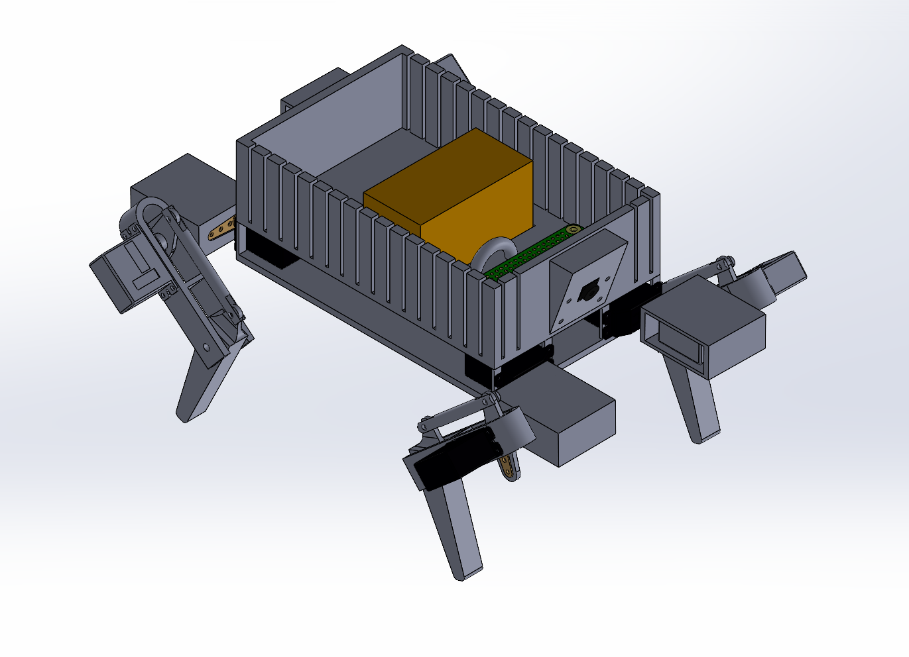

# Introduction

{ width="500" align=center }

Hey there! I'm **Andrii** - a 1st-year **Tron student at Waterloo**. For a while, I have wanted to tackle a serious solo
robotics project, and this is the result.

In short, the goal is to build a **quadruped robot** (think Boston Dynamics) that can also transition into **flight mode
** (aka quadcopter). It is a unique challenge that will force me to get hands-on with a massive set of tools, including
**CAD, kinematics, ROS, simulations, 3D printing, electronics, vision processing**, and more.

What you are looking at is an early version of the documentation for this project. I split it into two main parts:

* [**Devlog**](devlog/): frequent progress updates.
* [**Engineering**](engineering/): technical deep dives and decisions.

I don’t have a set timeline or a final vision yet, so the scope is bound to change as I work through this project...

---

[Read Devlog](devlog/){: .md-button }
[Engineering Details](engineering/){: .md-button }

